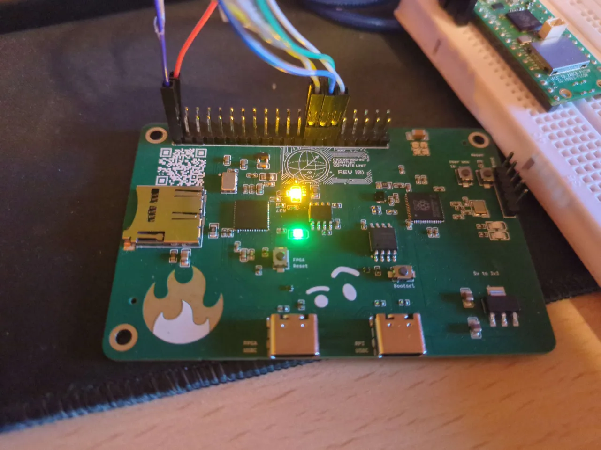

# FirePI

## What is the FirePi
It is an FPGA development board in the popular credit-card sized Raspberry Pi form factor.
It carries a Lattice ICE40UP5K, a small open-source fpga, and an rp2350A, a 2-core ARM/RISC-V mcu.

It also features 2 usb-c ports, one connected to the rp2350, and one to the ice40.
It also has 4 onboard neopixels, an SD card slot, and 45 headers, for expandibility and ease of use

## Features

- **Raspberry Pi form factor**
- **Lattice ICE40UP5K**
    - 5280 LUTs
    - 120 kbit RAM
    - 2 MB flash
    - 50 MHz external oscillator
- **Raspberry Pi RP2350A**
    - 2 RISC-V/ARM cores
    - 16 MB flash
- **2 USB-C ports**
- **SD card slot**
- **4 user NeoPixel LEDs**

## Documentation

- [Bill of Materials (BOM)](bom.csv)
- [Schematic (PDF)](schematic.pdf)